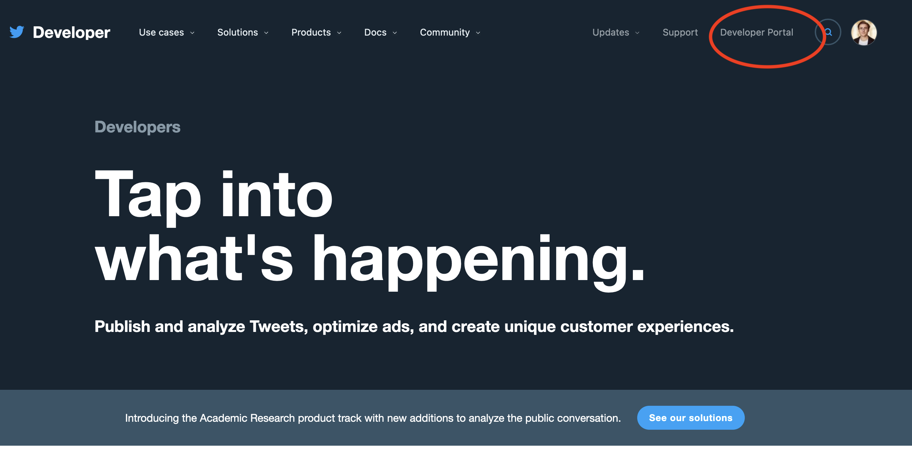

# Introduction-to-Computational-Text-Analysis-and-Social-Media-Research-using-R
An inter-semester course for Sciences Po, School of Research

# Setup Instructions
## Install R and RStudio

R and RStudio are two separate pieces of software: 

* **R** is a programming language that is especially powerful for data 
  exploration, visualization, and statistical analysis
* **RStudio** is an integrated development environment (IDE) that makes using 
  R easier. In this course we use RStudio to interact with R. 
  
If you don't already have R and RStudio installed, follow the instructions for 
your operating system below. You have to install R before you install RStudio. 

### Windows

* Download R from the 
  [CRAN website](https://cran.r-project.org/bin/windows/base/release.htm).
* Run the `.exe` file that was just downloaded
* Go to the [RStudio download page](https://www.rstudio.com/products/rstudio/download/#download)
* Under *Installers* select **RStudio x.yy.zzz - Windows
  Vista/7/8/10** (where x, y, and z represent version numbers)
* Double click the file to install it
* Once it's installed, open RStudio to make sure it works and you don't get any
  error messages.

### MacOS

* Download R from
  the [CRAN website](https://cran.r-project.org/bin/macosx/).
* Select the `.pkg` file for the latest R version
* Double click on the downloaded file to install R
* It is also a good idea to install [XQuartz](https://www.xquartz.org/) (needed
  by some packages)
* Go to the [RStudio download page](https://www.rstudio.com/products/rstudio/download/#download)
* Under *Installers* select **RStudio x.yy.zzz - Mac OS X 10.6+ (64-bit)**
  (where x, y, and z represent version numbers)
* Double click the file to install RStudio
* Once it's installed, open RStudio to make sure it works and you don't get any
  error messages.

### Linux

* Follow the instructions for your distribution
  from [CRAN](https://cloud.r-project.org/bin/linux), they provide information
  to get the most recent version of R for common distributions. For most
  distributions, you could use your package manager (e.g., for Debian/Ubuntu run
  `sudo apt-get install r-base`, and for Fedora `sudo yum install R`), but we
  don't recommend this approach as the versions provided by this are
  usually out of date. In any case, make sure you have at least R 3.3.1.
* Go to the
  [RStudio download page](https://www.rstudio.com/products/rstudio/download/#download)
* Under *Installers* select the version that matches your distribution, and
  install it with your preferred method (e.g., with Debian/Ubuntu `sudo dpkg -i
  rstudio-x.yy.zzz-amd64.deb` at the terminal).
* Once it's installed, open RStudio to make sure it works and you don't get any
  error messages.

### Update R and RStudio

If you already have R and RStudio installed, check if your R and RStudio are 
up to date:

* When you open RStudio your R version will be printed in the console on 
  the bottom left. Alternatively, you can type `sessionInfo()` into the console.
  If your R version is 4.0.0 or later, you don't need to update R for this 
  lesson. If your version of R is older than that, download and install the 
  latest version of R from the R project website
  [for Windows](https://cran.r-project.org/bin/windows/base/), 
  [for MacOS](https://cran.r-project.org/bin/macosx/),
  or [for Linux](https://cran.r-project.org/bin/linux/)
* To update RStudio to the latest version, open RStudio and click on 
  `Help > Check for updates`. If a new version is available, quit RStudio, 
  follow the instruction on screen.
  
Note: It is not necessary to remove old versions of R from your system, 
but if you wish to do so you can 
[check here.](https://cran.r-project.org/bin/windows/base/rw-FAQ.html#How-do-I-UNinstall-R_003f) 
  
[Credits](https://datacarpentry.org/R-ecology-lesson/#Install_R_and_RStudio)

## Authorization for Twitter Academic Research Product Track

In order to use the Twitter Academic Research Product Track you will first need to obtain an authorization token. You will find details about the process of obtaining authorization [here](https://developer.twitter.com/en/products/twitter-api/academic-research). Press the "Apply →" button under the Basic tier to start the application process (you need to have a Twitter account).

First, Twitter will ask for details about your academic profile. Per the documentation linked above, they will ask for the following:

> Your full name as it is appears on your institution’s documentation
> 
>   Links to webpages that help establish your identity; provide one or more of the following:
> 
>   - A link to your profile in your institution’s faculty or student directory
>   - A link to your Google Scholar profile
>   - A link to your research group, lab or departmental website where you are listed
> 
>   Information about your academic institution: its name, country, state, and city
> 
>   Your department, school, or lab name
> 
>   Your academic field of study or discipline at this institution
> 
>   Your current role as an academic (whether you are a graduate student, doctoral candidate,       post-doc, professor, research scientist, or other faculty member)

Twitter will then ask for details of the proposed research project. Here, questions include:

> 1. What is the name of your research project?
>
> 2. Does this project receive funding from outside your academic institution? If yes, please list all your sources of funding.
>
> 3. In English, describe your research project. Minimum 200 characters.
>
> 4. In English, describe how Twitter data via the Twitter API will be used in your research project. Minimum 200 characters.
>
> 5. In English, describe your methodology for analyzing Twitter data, Tweets, and/or Twitter users. Minimum 200 characters.
>
> 6. Will your research present Twitter data individually or in aggregate?
>
> 7. In English, describe how you will share the outcomes of your research (include tools, data, and/or other resources you hope to build and share). Minimum 200 characters.
>
> 8. Will your analysis make Twitter content or derived information available to a government entity?

Once you have gained authorization for your project you will be able to see the new project on your Twitter developer portal (this could take a few days). 

First click on the developer portal as below. 

Here you will see your new project, and the name you gave it, appear on the left hand side. Once you have associated an App with this project, it will also appear below the name of the project. Here, I have several Apps authorized to query the basic API. I have one App, named "gencap", that is associated with my Academic Research Product Track project. 

When you click on the project, you will first see how much of your monthly cap of 10m tweets you have spent. You will also see the App associated with your project below the monthly tweet cap usage information.

By clicking on the Settings icons for the App, you will be taken through to the information about the App associated with the project. Here, you will see two options listed, for "Settings" and "Keys and Tokens."

Beside the panel for Bearer Token, you will see an option to Regenerate the token. You can do this if you have not stored the information about the token and no longer have access to it. It is important to store information on the Bearer Token to avoid having to continually regenerate the Bearer Token information.

Once you have the Bearer Token, you are ready to go!

[Credits](https://cran.r-project.org/package=academictwitteR)

